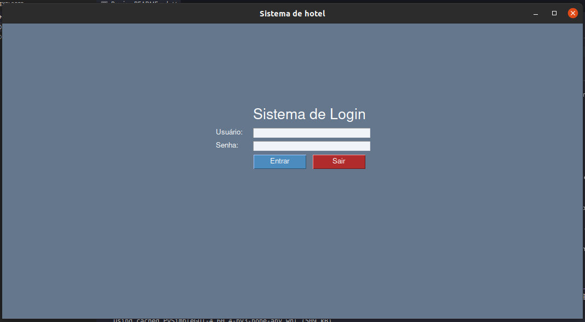
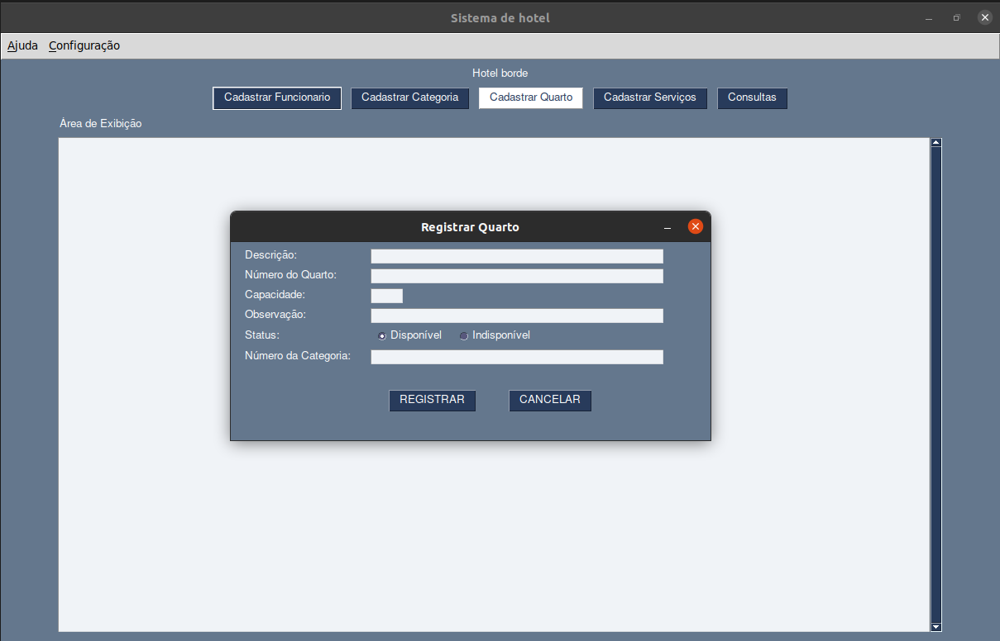
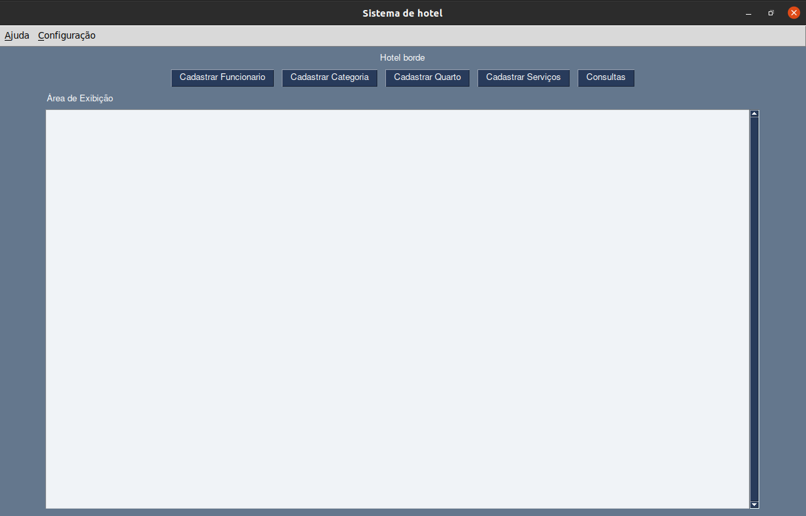
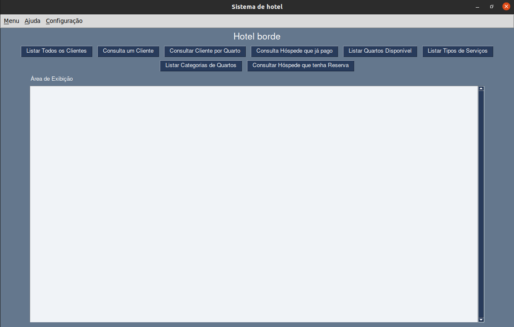
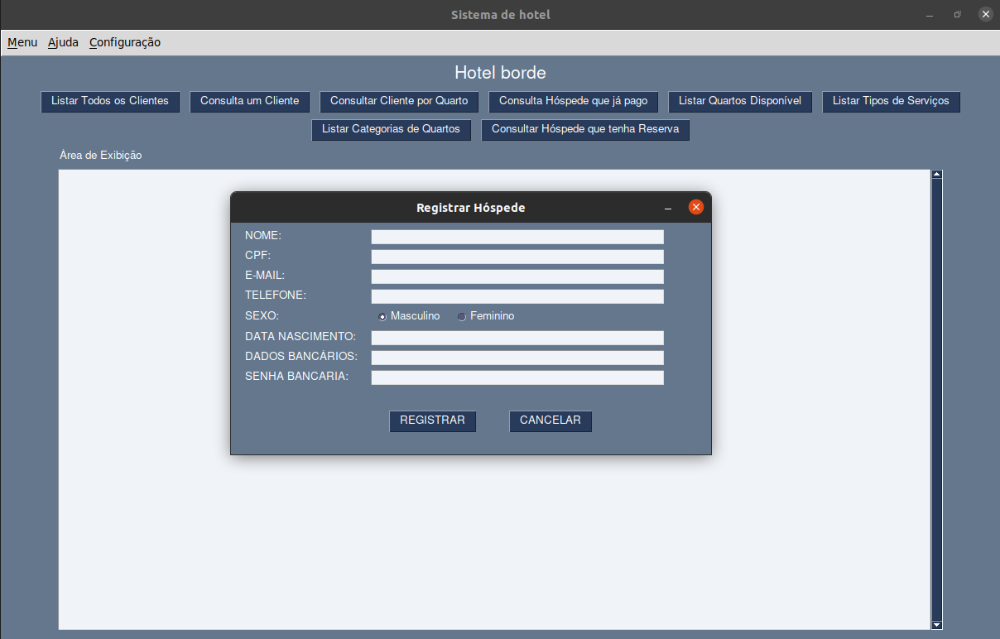

# Hotel







> O intuito desse prójeto é praticar POO respeitando os princípios de SOLID.

### Erro Conhecido
- **Erro de importação de Modulo** Ocorre um erro ao fazer as importações por pasta no projeto, sendo assim, não é possivel organizar os arquivos.

# Requisitos de Projeto para Sistema de Hotelaria

O objetivo deste projeto é desenvolver um sistema básico para hotelaria que permita o cadastro de hóspedes, funcionários, quartos, categorias, reservas, check-in, check-out, serviços e o cálculo total dos gastos do hóspede considerando a diária, data de entrada e saída e multa caso passe do prazo.

## Requisitos

1. [✅] Cadastro de hóspedes: o sistema deve permitir o cadastro de informações de hóspedes, como nome, CPF, telefone, e e-mail.
2. [✅] Cadastro de funcionários: o sistema deve permitir o cadastro de informações de funcionários, como nome, CPF, telefone, endereço, e-mail e função.
3. [✅] Cadastro de quartos: o sistema deve permitir o cadastro de informações de quartos, como número, descrição, capacidade e preço da diária.
4. [✅] Cadastro de categorias: o sistema deve permitir o cadastro de categorias de quartos, como luxo, suíte, standard, entre outros.
5. [✅] Reserva: o sistema deve permitir que o hóspede faça uma reserva do quarto desejado, escolhendo a categoria, data de check-in e check-out, número de pessoas, e serviço adicional, como café da manhã.
6. [✅] Check-in: o sistema deve permitir que o hóspede realize o check-in no hotel, informando os dados da reserva, os documentos necessários.
7. [✅] Check-out: o sistema deve permitir que o hóspede realize o check-out do hotel, informando a data de saída e o pagamento de eventuais serviços adicionais, como bar ou restaurante.
8. [✅] Serviços: o sistema deve permitir que o hóspede solicite serviços adicionais, como limpeza extra, café da manhã no quarto, massagem ou lavanderia, e deve registrar o pagamento desses serviços no momento do check-out.
9. [✅] Cálculo dos gastos: o sistema deve calcular automaticamente o valor total dos gastos do hóspede, levando em consideração o período de hospedagem, o preço da diária, o tipo de quarto e os serviços adicionais contratados. Caso o hóspede passe do prazo de check-out, o sistema deve aplicar uma multa proporcional ao período excedido.
10. [✅] Interface Grafica.

## Tecnologias Utilizadas

Python <br>
PySimpleGUI <br>
Sqlite3
<br>

## Processo de Instalação

Para instalar **Hotel**, siga estas etapas:

`Linux:`

Clone o Repósitorio :
```
git clone https://github.com/Wenderson-Oscar/Hotel.git
```
Crie o Ambiente Virtual:
```
virtualenv env
```
Ative o Ambiente Virtual:
```
. env/bin/activate
```
baixa as Dependencias:
```
pip install -r requirements.txt
```

## Criando Arquivo de Autenticação

# Passo 1

Iremos Criar o arquivo de autenticação na raiz do projeto:
```
touch authenticade.json
```

# Passo 2

Exemplo de Como teremos que preencher o arquivo de authenticade:
```
{"admin": {"username": "admin", "password": "senha_admin"},
"clerk": {"username": "clerk", "password": "senha_atendente"}}
```
substitua a 'senha_admin' e 'senha_atendente' por senha que preferir

## Para usar **Hotel**, execute o comando abaixo:

```
python3 app/home.py
```
`Aproveite.`
